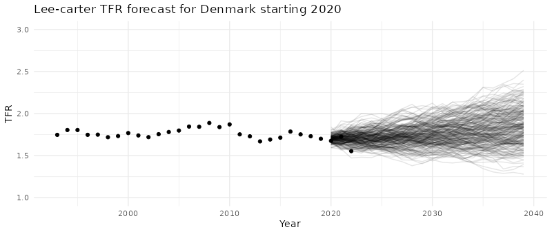

# StMoMo Lee-Carter TFR forecast based on ASFR

[Jonas Schöley](https://orcid.org/0000-0002-3340-8518)

This script illustrates how to use the [StMoMo](https://github.com/amvillegas/StMoMo) framework to forecast age specific fertility rates based on historical information on births and person-years exposure. We also illustrate how to implement a Lee-Carter variant with a parametric beta specification which can aid with convergence for difficult data series.

